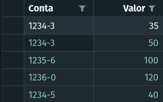
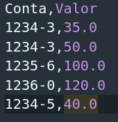
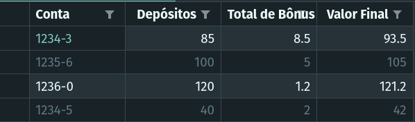
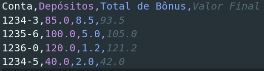

## First_Kotlin_Console_Project

This is a kotlin console project with bank operations theme. It reads a .csv file with an accountNumber(accountId) and a value for a deposit in that account. In the end, it returns another csv Bank statement file, named "extrato.csv".

##

  

_________________________________________________________________________________________________________________________________________

###

### Getting Started

This app was created using intelliJ IDEA with Kotlin:
- [Expo.io website](https://kotlinlang.org/docs/tutorials/jvm-get-started.html)

1. Clone this repository in the directory you want
2. Open and run it through intelliJ IDEA or another tool for kotlin
3. It will ask to enter a path for the csv you'll use to load the information
4. The example.csv is the file you'll use, so type "./example.csv"
5. After this the code will run and return a new csv file in the root folder of the project, it is named extrato.csv
6. That's it

### Examples csv's

- ###### Csv to read

    

    

- ###### Output Csv

    

    

#
_________________________________________________________________________________________________________________________________________

###

### Thanks for reading!

Any suggestions or questions, just send to me on twitter. I accept feedback because this is my first kotlin project.

- [My Twitter](https://twitter.com/PsMurilinho) - PsMurilinho 💙

______________________________________________________________________